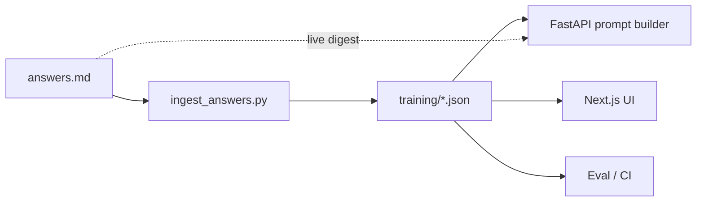
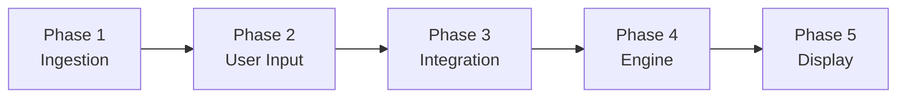
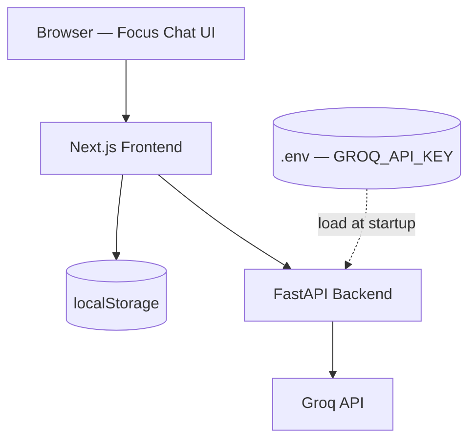
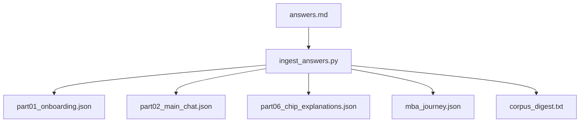
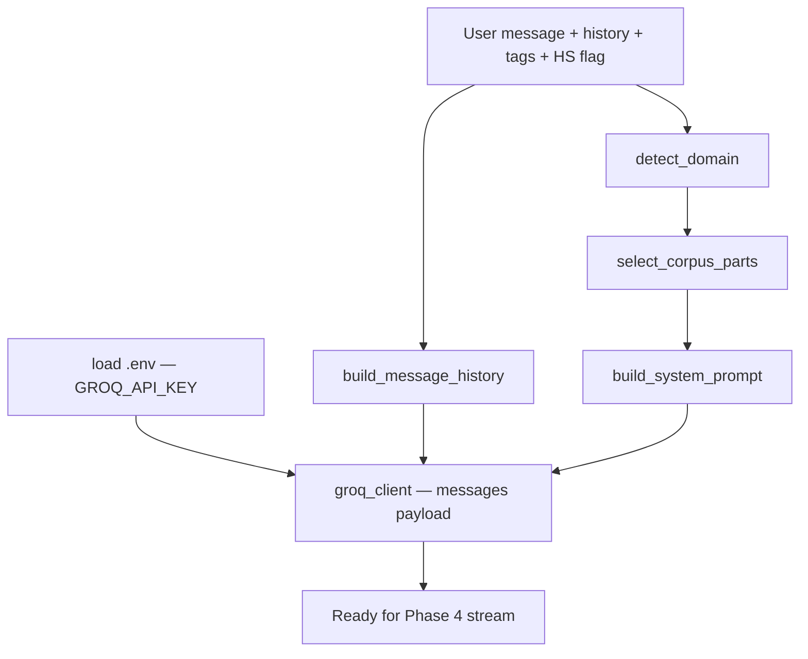
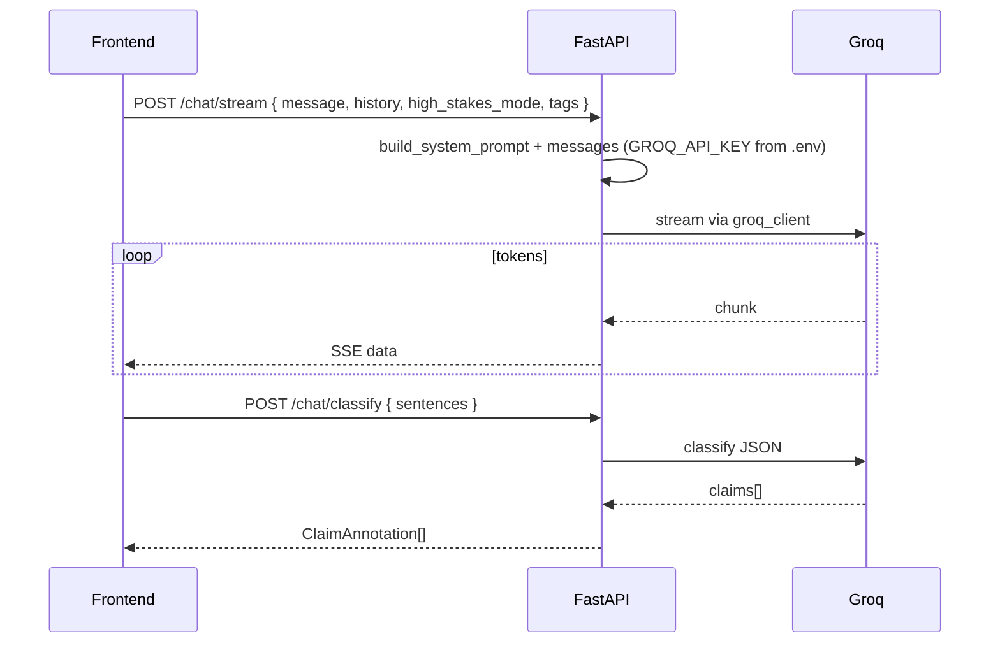
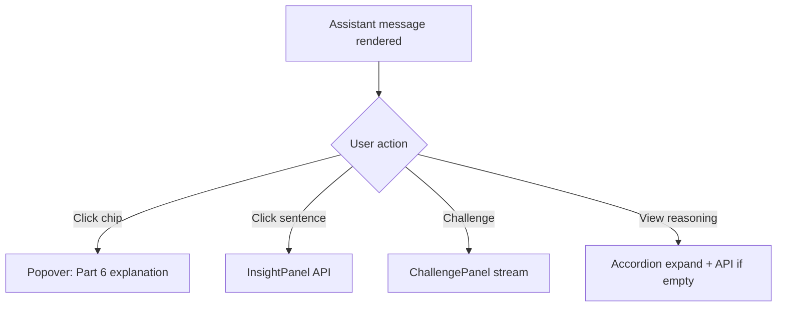
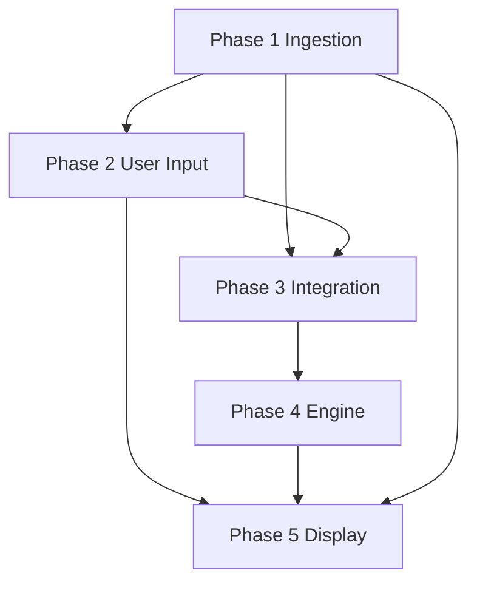

# Claude Lens — 5-Phase Architecture

**Version:** 1.3 · May 2026  
**Inputs:** `answers.md` (**model training corpus**), `Zomato AI/requirement.md` (LLM pipeline), `ui sample.png` (visual target), `requirements.md` (PRD detail)

---

## Model training layer (`answers.md`)

`answers.md` is not optional reference material — it is the **ground-truth training corpus** that drives prompts, fixtures, chip explanations, and CI goldens.



| Artifact | Source part | Consumed by |
|----------|-------------|-------------|
| `part01_onboarding.json` | Part 1 | Banner copy, E2E |
| `part02_main_chat.json` | Part 2 | Chat stream few-shot, demo |
| `part03_challenge.json` | Part 3 | `/challenge` goldens |
| `part04_reasoning.json` | Part 4 | `/reasoning` goldens |
| `part05_high_stakes.json` | Part 5 | HS prompts, DisclaimerBox |
| `part06_chip_explanations.json` | Part 6 | `/classify`, popovers |
| `part07_extended_qa.json` | Part 7 | Follow-up suggestions |
| `mba_journey.json` | Parts 1–7 | Full demo thread |
| `corpus_digest.txt` | All | System prompt (token-capped) |

### Training modes

| Mode | Flag | Behavior |
|------|------|----------|
| **Corpus-guided** | `CLAUDE_LENS_USE_CORPUS=1` | Inject digest + relevant part into every Groq call |
| **Demo playback** | `CLAUDE_LENS_DEMO_MODE=1` | Return `training/` JSON; no API key |
| **Eval regression** | `CLAUDE_LENS_EVAL_MODE=1` | Assert structure vs goldens |

### Bracket-tag parsing (ingest)

Corpus uses inline labels — e.g. `[Well-supported]`, `[Inferred]`, `[WEAK EVIDENCE FLAG]` — which `ingest_answers.py` strips from display text and maps to `ClaimAnnotation.label` and `Message.flags[]`.

---

## Overview

Claude Lens is a dark-themed, annotation-first chat product that helps users **think with AI, not blindly trust it**. Architecture is organized in **five phases** that mirror the Zomato recommendation workflow—adapted from restaurants to **reasoning, trust labels, and verification**.

| Phase | Zomato analogue | Claude Lens focus |
|-------|-----------------|-------------------|
| **1** | Data ingestion | **Parse `answers.md` → `training/`**, corpus digest, design system, scaffold |
| **2** | User input | Header, tags, input, onboarding banner (Part 1) |
| **3** | Integration layer | **`phase 3/`** — prompt assembly, corpus, Groq client (`.env`) |
| **4** | Recommendation engine | **`phase 4/`** — FastAPI, stream, classify, challenge, reasoning |
| **5** | Output display | **`phase 2/`** UI + Phase 5 panels — **frontend API wiring deferred** (see below) |



**Stack:** Next.js (App Router) + Tailwind + Framer Motion · FastAPI (Zomato phase-4 pattern) · **Groq LLM** (Phase 3+) · `localStorage` for MVP persistence.

---

## System context



---

## UI target (`ui sample.png`)

The **Phase 5 display layer** must match the sample screen:

| Region | Elements | Notes |
|--------|----------|-------|
| **Header** | `New` · conversation title · removable tags (`career`, `decision`, `high-stakes`) · `+ Tag` · High-Stakes toggle (shield, orange when on) | Title from first user message |
| **Chat** | Right-aligned user bubble · `DisclaimerBox` (shield, brown tint) · serif body with underlined claims + inline chips | Chips: Well-supported (green), Inferred (gold), Speculative (purple), Missing context (grey) |
| **Footer** | Rounded `ChatInput` · send arrow · tagline *"Claude can be wrong…"* | Placeholder: *"Ask Claude something you want to think through carefully…"* |

**Design tokens (dark default):**

```css
--bg-primary: #1a1614;
--bg-elevated: #252019;
--bg-user-bubble: #2d2824;
--bg-disclaimer: #3d2f24;
--text-primary: #f5f0eb;
--accent-orange: #e8784a;
--chip-well-supported: #6fcf97 on #1e3d2a;
--chip-inferred: #e8c547 on #3d3520;
--chip-speculative: #b794f6 on #352a3d;
--chip-missing: #9e9e9e on #2a2a2a;
--font-ui: 'Inter', sans-serif;
--font-body: 'Source Serif 4', Georgia, serif;  /* research/editorial feel */
```

Extended layout (sidebar, insight/challenge panels) ships in Phase 5 as **Mode B**; the sample is **Mode A** (`/c/[id]`).

### Implementation status & folder map

| Phase | Folder | Status |
|-------|--------|--------|
| 1 | `phase 1/` | Done — ingest, `training/`, types |
| 2 | `phase 2/` | Done — Next.js UI + SSE stream + chips (`localhost:8000`) |
| 3 | `phase 3/` | Done — integration layer + unit tests |
| 4 | `phase 4/` | Done — FastAPI + engine + API tests |
| 5 | — | Challenge panel, reasoning accordion (next) |

**Frontend ↔ API (done):** `phase 2/` calls `NEXT_PUBLIC_API_BASE_URL` (default `http://localhost:8000`) for `/api/v1/chat/stream` (SSE) and `/api/v1/chat/classify` (chips). Challenge/reasoning panel buttons — next increment.

---

## Journey map (`answers.md` → phases)

| `answers.md` part | User moment | Primary phase |
|-------------------|-------------|---------------|
| Part 1 | MBA keyword → High-Stakes banner → Enable | 2 + 3 |
| Part 2 | Main chat + follow-ups | 4 + 5 |
| Part 3 | Challenge this answer | 4 + 5 |
| Part 4 | Reasoning accordion (5 sections) | 4 + 5 |
| Part 5 | High-Stakes copy, flags, verification | 3 + 5 |
| Part 6 | Chip click → explanations | 4 + 5 |
| Part 7 | Extended Q&A | 4 + 5 |

---

# Phase 1 — Data & Context Ingestion (+ Model Training Corpus)

*Zomato: load HF dataset, extract fields. Claude Lens: load `answers.md` → structured training JSON.*

### Purpose

Establish **everything the system needs before a user types**: ingest the MBA journey corpus, generate `training/` artifacts, define schemas, and apply visual foundation.

### Ingest pipeline



**Script:** `claude-lens-api/scripts/ingest_answers.py`

```bash
python scripts/ingest_answers.py \
  --source "../../Claude Lens/answers.md" \
  --out training/
```

**Parsing responsibilities:**

| Pattern in `answers.md` | JSON field |
|-------------------------|------------|
| `USER ASKS:` / `CLAUDE RESPONDS:` | `turns[].user` / `turns[].assistant` |
| `[Well-supported]` etc. at sentence end | `claims[].label` |
| `[WEAK EVIDENCE FLAG]` | `assistant.flags[]` |
| Part 3 section headers | `challenge.*` arrays |
| Part 4 `SECTION n` | `reasoning.*` fields |
| Part 6 `SENTENCE` / `CHIP` / `EXPLANATION` | `chip_explanations[]` |
| Part 7 `Q:` / `A:` | `extended_qa[]` |

### Deliverables

| Item | Description |
|------|-------------|
| **Monorepo layout** | `claude-lens-web/` (Next.js), `claude-lens-api/` (FastAPI) |
| **`training/` directory** | Seven part JSON files + `mba_journey.json` + `corpus_digest.txt` |
| **`ingest_answers.py`** | Idempotent parser; CI runs on every `answers.md` change |
| **Conversation model** | `Conversation`, `Message`, `ClaimAnnotation` types |
| **Keyword lexicon** | MBA → Part 1 banner (exact copy) |
| **Domain templates** | From Part 5 verification bullets (career/MBA default) |
| **Design tokens** | Dark default from `ui sample.png` |

### Data model

```typescript
interface Conversation {
  id: string;
  title: string;
  tags: string[];
  highStakesMode: boolean;
  messages: Message[];
  createdAt: string;
  updatedAt: string;
}

interface Message {
  id: string;
  role: 'user' | 'assistant';
  content: string;
  claims?: ClaimAnnotation[];
  verificationSteps?: string[];
  createdAt: string;
}

interface ClaimAnnotation {
  id: string;
  startOffset: number;
  endOffset: number;
  label: ConfidenceLabel;
  explanation: string;
}

type ConfidenceLabel =
  | 'well_supported' | 'inferred' | 'speculative' | 'missing_context'
  | 'strongly_supported' | 'multiple_interpretations' | 'limited_evidence'
  | 'requires_human_judgment';
```

### Persistence (MVP)

| Key | Content |
|-----|---------|
| `claude-lens:conversations` | Index: `{ id, title, updatedAt }[]` |
| `claude-lens:conversation:{id}` | Full conversation JSON |

### `mba_journey.json` (canonical trained thread)

```json
{
  "version": "1.0",
  "reference_query": "Should I pursue an MBA in 2027?",
  "tags": ["career", "decision", "high-stakes"],
  "turns": [
    {
      "user": "Should I pursue an MBA in 2027?",
      "assistant": {
        "content": "Pursuing an MBA in 2027 depends heavily on...",
        "claims": [
          {
            "sentence": "Top MBA programs from schools like Harvard...",
            "label": "well_supported",
            "explanation": "Consistent across GMAC employer surveys..."
          }
        ]
      }
    }
  ],
  "follow_ups": [
    "What is the average ROI of an MBA from a top school?",
    "Which industries benefit most from an MBA in 2027?",
    "Is a part-time or online MBA worth it compared to full-time?"
  ],
  "challenge": { "counterarguments": [], "weak_assumptions": [], "alternative_viewpoints": [], "where_it_may_fail": [] },
  "reasoning": { "quick_answer": "", "key_assumptions": [], "reasoning_summary": "", "source_grounding": [], "alternative_interpretations": [] },
  "high_stakes": { "banner": "", "disclaimer": "", "verification_steps": [] }
}
```

### Phase 1 exit criteria

- [ ] `ingest_answers.py` runs clean; all 7 part files + `mba_journey.json` emitted  
- [ ] `test_corpus_parsing.py` validates schema for every artifact  
- [ ] Part 6 contains **9** chip explanation entries  
- [ ] Part 2 contains **4** turns (1 primary + 3 follow-ups)  
- [ ] Repos build; types shared FE/API  
- [ ] Static UI matches header + input chrome (dark)  

---

# Phase 2 — User Input & Session Layer

*Zomato: collect location, budget, cuisine, rating, extras.*

### Purpose

Capture **session intent**—query, tags, High-Stakes preference—and render the **input shell** from the UI sample before LLM wiring.

### UI components

```
ConversationHeader
├── NewChatButton          → new id, navigate /c/{id}
├── EditableTitle          → truncate first message (40 chars)
├── TagList + AddTagButton → slugs: career, decision, high-stakes
└── HighStakesToggle       → shield + orange switch

ChatInput                  → auto-grow (max 5 lines), Enter send, Shift+Enter newline
ChatFooter                 → static disclaimer line

AutoSuggestBanner          → Part 1: "This looks like a high-stakes…" [Enable] [Dismiss]
UserMessageBubble          → right-aligned, dark rounded
```

### Input → session state

| User action | State update |
|-------------|--------------|
| Type in input | Debounced keyword scan (800ms) → may show `AutoSuggestBanner` |
| Click **Enable** on banner | `highStakesMode = true`, add tag `high-stakes` |
| Toggle header switch | Same + persist preference |
| **+ Tag** | Append normalized slug to `tags[]` |
| Send message | Append `user` message; call Phase 4 stream (stub OK in Phase 2) |

### Keyword detection (Part 1)

```typescript
// highStakesKeywords.ts — excerpt
export const HIGH_STAKES_KEYWORDS = [
  'mba', 'investment', 'diagnosis', 'cancer', 'finance', 'salary',
  'surgery', 'phd', 'legal', 'lawsuit', 'mortgage', 'crypto',
];
```

Banner copy (from `answers.md`):

> This looks like a high-stakes career and financial decision. Enable High-Stakes Mode for added scrutiny and verification guidance.

### Phase 2 exit criteria

- [ ] Full header + input + footer match `ui sample.png` (static)  
- [ ] User messages appear right-aligned  
- [ ] Banner appears on "MBA" typing; Enable sets toggle + tag  
- [ ] New chat clears stream; history index updates on first send  

---

# Phase 3 — Integration Layer

*Zomato: filter catalog, prepare structured shortlist, design ranking prompt.*

### Purpose

**Assemble prompts and context** from session state and wire the **Groq LLM** client—no new UI beyond banners. This is the brain between user input (Phase 2) and streamed responses (Phase 4).

### Groq LLM & environment (`.env`)

Claude Lens uses **[Groq](https://groq.com)** for all live inference (aligned with the Zomato AI reference stack). Configuration is **non-negotiable for Phase 3**:

| Item | Location | Notes |
|------|----------|--------|
| **API key** | `.env` at **project root** (`claude-lens-api/.env` or monorepo root) | `GROQ_API_KEY=<your_key>` |
| **Example file** | `.env.example` | Committed with empty `GROQ_API_KEY=` — no real secrets |
| **Gitignore** | `.env` | Must never be committed |
| **Load timing** | FastAPI startup / CLI | `python-dotenv` → `os.environ["GROQ_API_KEY"]` |
| **Model override** | `.env` optional | `GROQ_MODEL=llama-3.3-70b-versatile` (or `llama-3.1-8b-instant` for dev) |
| **Client module** | `src/claude_lens/integration/groq_client.py` | OpenAI-compatible chat completions + streaming |

```bash
# .env.example (committed)
GROQ_API_KEY=
GROQ_MODEL=llama-3.3-70b-versatile
CLAUDE_LENS_USE_CORPUS=1
CLAUDE_LENS_DEMO_MODE=0
```

**Rules:**

- The **frontend never reads** `GROQ_API_KEY`; only the FastAPI backend calls Groq.
- If `GROQ_API_KEY` is missing and `CLAUDE_LENS_DEMO_MODE=0`, `/api/v1/*` LLM routes return `503` with a clear configuration error.
- Phase 3 delivers a **testable Groq connection** (smoke test similar to Zomato `test_groq_llm_connection.py`).

### Pipeline



### Corpus selection (`select_corpus_parts`)

| User action | Load from `training/` |
|-------------|------------------------|
| Main chat | `part02` + `part07` (extended Q&A) + `corpus_digest.txt` |
| High-Stakes on | `part05` appended |
| Challenge click | `part03` few-shot |
| View reasoning | `part04` few-shot |
| Classify | `part06` few-shot (9 goldens) |

Token budget: ~6k for corpus; prefer JSON extracts over raw markdown.

### `prompt_builder.py`

| Input | Effect on system prompt |
|-------|-------------------------|
| `use_corpus: true` | Prepend `corpus_digest.txt` + selected part JSON |
| `high_stakes_mode: true` | Append `part05_high_stakes.json` rules: flags, verification, disclaimer |
| `domain: career` | MBA verification bullets from Part 5 |
| `tags` | `high-stakes` reinforces HS appendix |
| Base | Claude Lens persona; **do not emit bracket chip tags** in prose |

**Base system prompt (excerpt):**

```
You are Claude Lens. Help users inspect answers before acting.
Write in clear, distinct claims—one idea per sentence where possible.
Use markdown links [Title](URL) for sources. Never invent numeric trust scores.
```

**High-Stakes appendix (from Part 5):**

- Prefix uncertain claims with conceptual flags the UI can parse: `[WEAK EVIDENCE]`, `[ASSUMPTION]`
- End with 3–5 concrete verification steps
- Include warning suitable for `DisclaimerBox`

### Domain detection

| Domain | Trigger examples | Verification template |
|--------|------------------|------------------------|
| career | mba, job, salary, promotion | advisor, alumni, school reports |
| finance | invest, mortgage, crypto | fee-only advisor, SEC/consumer sites |
| health | symptom, medication, diet | clinician, not self-diagnose |
| legal | contract, lawsuit, rights | licensed attorney |
| research | citation, methodology | primary sources, peer review |

### History trimming

- Keep last **N** turns (e.g. 20) or **token budget** ~8k for user/assistant pairs  
- Always include **first user message** for title/context  

### Phase 3 directory (`phase 3/`)

```
phase 3/
├── src/claude_lens/
│   ├── env.py
│   └── integration/
│       ├── prompt_builder.py
│       ├── corpus_loader.py   → ../../phase 1/training/
│       ├── keyword_detect.py
│       └── groq_client.py
└── tests/test_phase3_integration.py
```

`.env` lives at **Claude Lens root** (not inside `phase 3/`).

### Phase 3 exit criteria

- [ ] `.env.example` committed; `.env` gitignored; `python-dotenv` loads on app start  
- [ ] `groq_client.py` calls Groq when `GROQ_API_KEY` is set  
- [ ] `build_system_prompt()` includes corpus when `use_corpus=true`  
- [ ] MBA query + HS → prompt contains Part 5 appendix + verification steps  
- [ ] `select_corpus_parts()` returns correct files per action  
- [ ] Disclaimer string matches Part 5 warning verbatim  
- [ ] Integration smoke test passes with valid `GROQ_API_KEY` in `.env`

---

# Phase 4 — Reasoning Engine (LLM)

*Zomato: LLM ranks restaurants, explains fit, summarizes.*

### Purpose

Run **all Groq-backed interactions** via the Phase 3 client: streaming answers, async claim classification, challenge, reasoning accordion, claim insight.

### API surface (`phase 4/` — FastAPI)

```
phase 4/
├── src/claude_lens/
│   ├── api/app.py, schemas.py
│   ├── engine/
│   │   ├── stream_chat.py
│   │   ├── classify_claims.py
│   │   ├── demo_playback.py
│   │   ├── challenge.py, reasoning.py, insight.py
│   └── shared/config.py
└── tests/test_phase4_api.py
```

Training data: `phase 1/training/`. Run API:

`PYTHONPATH="phase 4/src:phase 3/src" uvicorn claude_lens.api.app:app --port 8000`

| Endpoint | Role | `answers.md` |
|----------|------|--------------|
| `POST /api/v1/chat/stream` | SSE token stream | Part 2, 5, 7 |
| `POST /api/v1/chat/classify` | Sentence → chip JSON | Part 6 |
| `POST /api/v1/challenge` | Devil's advocate sections | Part 3 |
| `POST /api/v1/reasoning` | Accordion 5 sections | Part 4 |
| `POST /api/v1/insight` | Claim-level detail | PRD insight panel |
| `GET /health` | Liveness | — |

### 4.1 Main chat stream



- **Provider:** Groq (Phase 3 `groq_client.py`)  
- **Model:** `GROQ_MODEL` from `.env`, default `llama-3.3-70b-versatile` (fast dev: `llama-3.1-8b-instant`)  
- **Streaming:** show plain text first; chips after classify returns (PRD: non-blocking)  
- **Sentence split:** heuristic `/(?<=[.!?])\s+/` with abbreviation guards  

### 4.2 Classify claims (Part 6)

Second call returns JSON. **Few-shot block** is built from `training/part06_chip_explanations.json` (9 reference sentences from `answers.md`).

```json
{
  "claims": [
    {
      "index": 0,
      "label": "well_supported",
      "explanation": "Consistent across GMAC employer surveys, school employment reports..."
    }
  ]
}
```

**Fallback order:** (1) API classify → (2) exact match in `part06` → (3) hedge-word heuristic.

Map `label` → chip color (Phase 5). In High-Stakes mode, append PRD suffixes to chip tooltips.

### 4.6 Demo playback engine

When `CLAUDE_LENS_DEMO_MODE=1`, `demo_playback.py` serves pre-parsed turns from `mba_journey.json` without calling Groq (no `GROQ_API_KEY` required):

| Request | Response source |
|---------|-----------------|
| First MBA question | `turns[0].assistant` from Part 2 |
| Follow-up ROI / industries / part-time | `turns[1..3]` |
| Challenge | `challenge` object from Part 3 |
| Reasoning | `reasoning` object from Part 4 |
| Classify | `claims[]` embedded in turn |

### 4.7 Eval regression (`CLAUDE_LENS_EVAL_MODE=1`)

| Test | Golden source | Assert |
|------|---------------|--------|
| Main answer | Part 2 | ≥6 claims; labels in allowed set |
| Challenge | Part 3 | 4 sections non-empty |
| Reasoning | Part 4 | 5 fields present |
| Chips | Part 6 | 9 explanations resolvable |
| Banner | Part 1 | Exact enable banner copy |
| HS disclaimer | Part 5 | Disclaimer substring match |

### 4.3 Challenge (Part 3)

**Request:** `{ message_id, original_content, user_followup? }`  

**Response:**

```typescript
interface ChallengeResponse {
  counterarguments: string[];
  weak_assumptions: string[];
  alternative_viewpoints: string[];
  where_it_may_fail: string[];
}
```

System tone: collaborative critic (not "Claude was wrong").

### 4.4 Reasoning accordion (Part 4)

**Response:**

| Field | Content |
|-------|---------|
| `quick_answer` | Section 1 TL;DR |
| `key_assumptions` | Bullets — Section 2 |
| `reasoning_summary` | Paragraph — Section 3 |
| `source_grounding` | `{ title, url, confidence }[]` — Section 4 |
| `alternative_interpretations` | string[] — Section 5 |

### 4.5 Security

- `GROQ_API_KEY` in **`.env` only** — server-side; never exposed to Next.js or the browser  
- Commit **`.env.example`**; never commit **`.env`**  
- Sanitize markdown URLs; block `javascript:`  
- Rate-limit classify/challenge per IP  

### Phase 4 exit criteria

- [ ] Corpus-guided stream matches Part 2 depth (live API)  
- [ ] Demo mode returns full `mba_journey` without API key  
- [ ] Classify uses Part 6 few-shots; fallback lookup works  
- [ ] Challenge/reasoning match Part 3/4 structure in eval  
- [ ] `test_golden_mba_journey.py` passes in CI  

---

# Phase 5 — Output Display & Full Experience

*Zomato: show name, cuisine, rating, cost, AI explanation.*

### Purpose

Render **trust UI** exactly like the sample, wire all Phase 4 endpoints, and complete the `answers.md` journey (challenge, accordion, sidebar history).

### 5.1 Core display components

| Component | Responsibility | Sample / journey |
|-----------|----------------|------------------|
| `AnnotatedText` | Serif body; underline spans; attach chips | Main AI block |
| `ConfidenceChip` | Pill + click → popover (Part 6 explanation) | Green / gold / purple / grey |
| `DisclaimerBox` | Shield + Part 5 warning when HS on | Below user bubble |
| `HighStakesBanner` | Top-of-chat persistent reminder | Part 5 top banner |
| `VerificationList` | Bulleted "Before acting…" steps | Part 5 |
| `MessageActions` | Challenge · View reasoning · model label | Parts 3–4 |
| `ReasoningAccordion` | 5 collapsible sections | Part 4 |
| `ChallengePanel` | Amber-tinted side panel | Part 3 |
| `InsightPanel` | Claim evidence on sentence click | PRD + Part 6 |

### 5.2 `AnnotatedText` render flow

```
1. Render content as streaming plain text (serif)
2. On classify complete → merge ClaimAnnotation offsets
3. Wrap spans: hover peach underline; click → insight or popover
4. Append single ConfidenceChip per sentence (no stacking)
5. If HS: ⚠️ on weak_evidence spans; yellow underline on assumptions
```

### 5.3 Layout modes

**Mode A — Focus (default, `ui sample.png`):**

```
┌─────────────────────────────────────────────┐
│ New │ Title │ tags… │ High-Stakes toggle   │
├─────────────────────────────────────────────┤
│                        [User bubble]        │
│ [DisclaimerBox]                             │
│ Assistant AnnotatedText + chips             │
│ [MessageActions] [ReasoningAccordion]       │
├─────────────────────────────────────────────┤
│ ChatInput                          [Send]   │
│ footer disclaimer                           │
└─────────────────────────────────────────────┘
```

**Mode B — Full app (`requirements.md`):**

```
┌──────────┬────────────────────┬────────────┐
│ Sidebar  │ Mode A chat column │ Panel 320px│
│ history  │                    │ Insight or │
│ HS toggle│                    │ Challenge  │
└──────────┴────────────────────┴────────────┘
```

Panel mutex: only Insight **or** Challenge open; Escape closes.

### 5.4 Chip taxonomy (sample + PRD)

| Label (UI) | Sample color | PRD equivalent |
|------------|--------------|----------------|
| Well-supported | Green | Well-supported / Strongly supported |
| Inferred | Gold/orange | Inferred |
| Speculative | Purple | Speculative |
| Missing context | Grey | Requires human judgment / Limited evidence |

### 5.5 Message action flows



### 5.6 Frontend structure

```
src/
├── app/c/[id]/page.tsx       # Mode A
├── app/page.tsx              # Mode B shell
├── components/
│   ├── header/ConversationHeader.tsx
│   ├── chat/AnnotatedText.tsx, DisclaimerBox.tsx, ChatInput.tsx
│   ├── trust/ConfidenceChip.tsx, ReasoningAccordion.tsx
│   └── panels/ChallengePanel.tsx, InsightPanel.tsx
├── hooks/useClaudeStream.ts, useKeywordDetection.ts, useChatHistory.ts
└── lib/api-client.ts, sentenceSplit.ts, parseMarkdownLinks.ts
```

### 5.7 Testing & demo

| Test | Validates |
|------|-----------|
| `test_corpus_parsing.py` | `answers.md` → `training/` after ingest |
| `test_golden_mba_journey.py` | Demo mode ≡ Part 2–7 content |
| `test_chip_explanations.py` | 9 Part 6 popovers |
| Visual regression | Header, disclaimer, chip colors vs sample |
| E2E Playwright | Part 1 banner → Enable → MBA → chips → challenge → accordion |
| Live eval (optional) | `EVAL_MODE` structural match vs goldens |

### Phase 5 exit criteria

- [ ] Pixel-faithful Mode A (dark) for MBA screenshot scenario  
- [ ] All Part 1–6 interactions work end-to-end  
- [ ] Mode B: history, New/Clear chat, sidebar HS toggle  
- [ ] Links open in new tab; keyboard + ARIA on icon buttons  
- [ ] Deployed: Vercel (FE) + containerized FastAPI (BE)  

---

## Cross-phase dependency graph



| Phase | Depends on | Can parallelize with |
|-------|------------|----------------------|
| 1 | — | — |
| 2 | 1 (types, tokens) | Late 3 (prompt stubs) |
| 3 | 1 | 2 (after types exist) |
| 4 | 3 | 5 shell (mock stream) |
| 5 | 2, 4 | — |

**Suggested timeline:** 1 → 2 ∥ 3 → 4 → 5 (2–3 weeks MVP with one full-stack dev).

---

## Zomato → Claude Lens phase mapping (reference)

| Zomato `requirement.md` step | Claude Lens implementation |
|------------------------------|----------------------------|
| Load Zomato dataset from Hugging Face | **Ingest `answers.md`** → `training/*.json` via `ingest_answers.py` |
| Extract restaurant fields | Extract turns, claims, challenge, reasoning, chip explanations |
| Collect user preferences | Header tags, HS toggle, chat input, banner Enable |
| Filter data for prompt | History trim, domain detect, HS appendix injection |
| Groq API key in `.env` | `GROQ_API_KEY` loaded at startup (Phase 3) |
| LLM rank + explain | Groq stream answer, classify, challenge, reasoning, insight |
| Display recommendations | AnnotatedText, chips, disclaimer, panels, accordion |

---

## Behaviors to avoid (all phases)

- Numeric trust scores (e.g. "72% confident")  
- Red alarm UI; use amber/brown callouts  
- Multiple panels open at once  
- Blocking chat until classification finishes  
- Generic "AI may be wrong" without domain-specific verification  
- API keys in frontend bundle or committed repo (use `.env` + `.gitignore` only)  

---

## Reference documents

| File | Path | Role |
|------|------|------|
| **Training corpus** | `Claude Lens/answers.md` | Ground truth — ingest to `training/` |
| PRD | `Claude Lens/requirements.md` | §12 Model Training Pipeline |
| UI mock | `Claude Lens/ui sample.png` | Dark focus layout |
| Pipeline pattern | `Zomato AI/requirement.md` | 5-phase mapping |
| Zomato API reference | `Zomato AI/src/restaurant_rec/phase4/` | FastAPI patterns |

---

## Appendix A — Part 6 chip golden index

| # | Sentence (abbrev.) | Label |
|---|-------------------|-------|
| 1 | Top MBA programs… consulting and finance | Well-supported |
| 2 | Median starting salaries $150k–$175k | Well-supported |
| 3 | Job market… remained strong | Inferred |
| 4 | MBA adds less value… technical track | Multiple interpretations |
| 5 | Network argument… overstated | Speculative |
| 6 | MBA brand premium… declining | Limited evidence |
| 7 | 2027 timing… uncertainty | Requires human judgment |
| 8 | ROI drops… part-time/online | Inferred |
| 9 | Consulting and banking… structural value | Strongly supported |

Full explanations live in `answers.md` Part 6 → `training/part06_chip_explanations.json`.

---

## Appendix B — Re-ingest on corpus change

When `answers.md` is edited:

1. Run `ingest_answers.py`
2. Commit updated `training/`
3. CI runs parsing + golden tests
4. Bump `mba_journey.json` `version` if breaking

---

## Runtime Status (2026-05-30)

- Frontend dev server (`npm run dev -- -p 3001`) has been stopped.
- Backend FastAPI server (`uvicorn claude_lens.api.app:app --host 127.0.0.1 --port 8000`) has been stopped.
- To restart:
  - Backend: `cd phase 4 && uvicorn claude_lens.api.app:app --host 127.0.0.1 --port 8000`
  - Frontend: `cd phase 2 && npm run dev -- -p 3001`

---

## Deployment

- **Backend**: Deploy the FastAPI service using **Streamlit** (as a Streamlit app wrapping the API endpoints).
- **Frontend**: Deploy the Next.js app to **Vercel** (automatic builds, preview URLs, and environment variable support).

---

*End of 5-phase architecture.*
